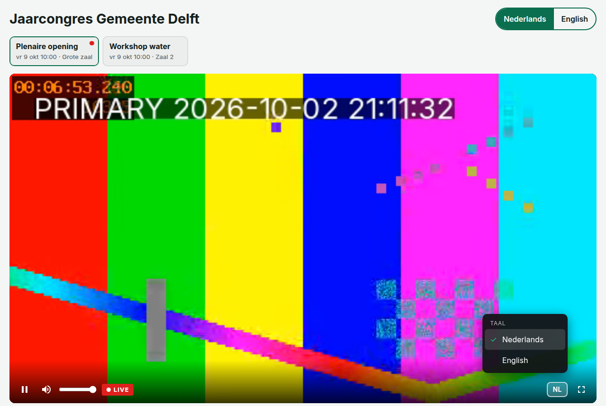
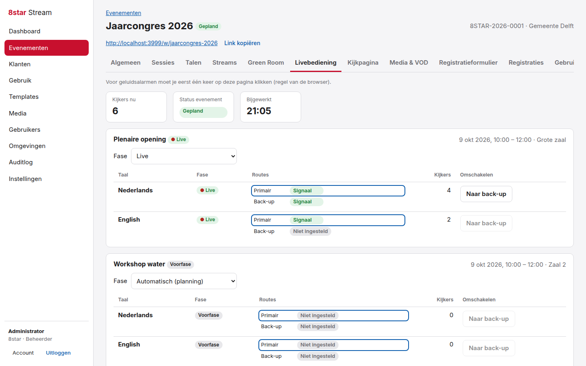
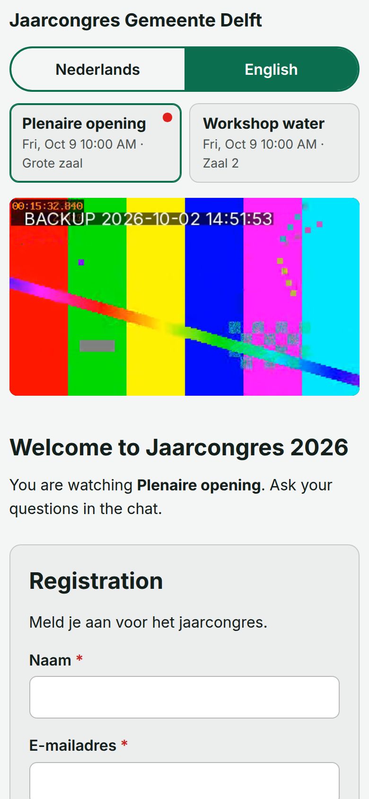
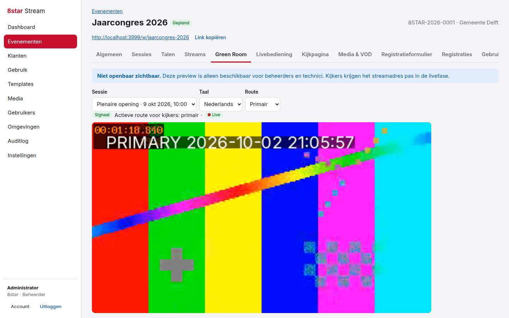
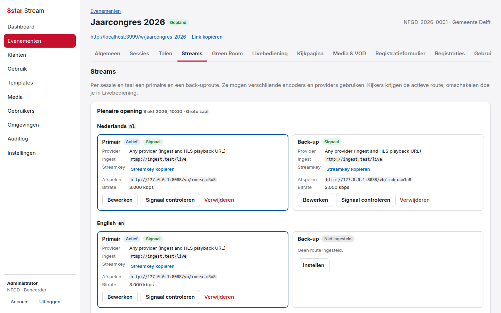
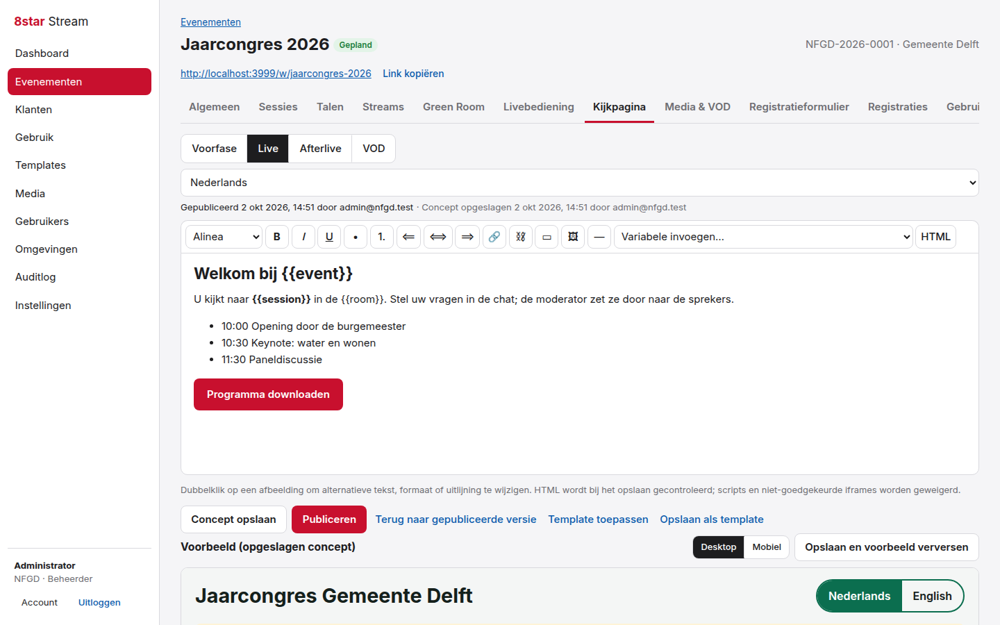
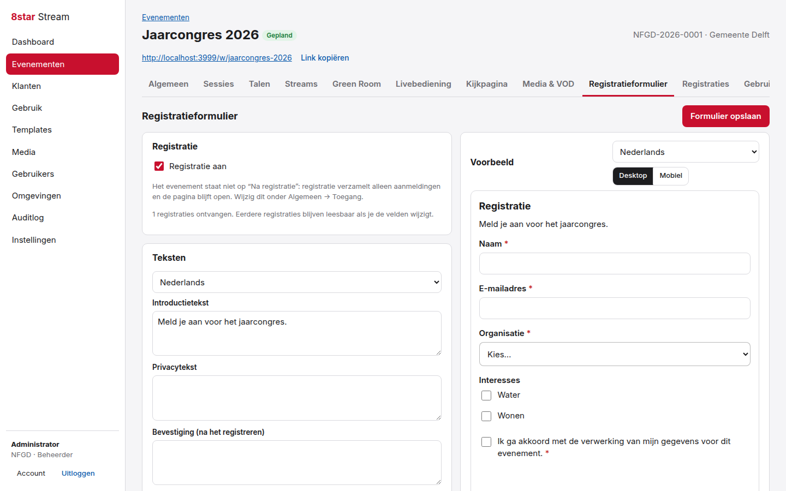
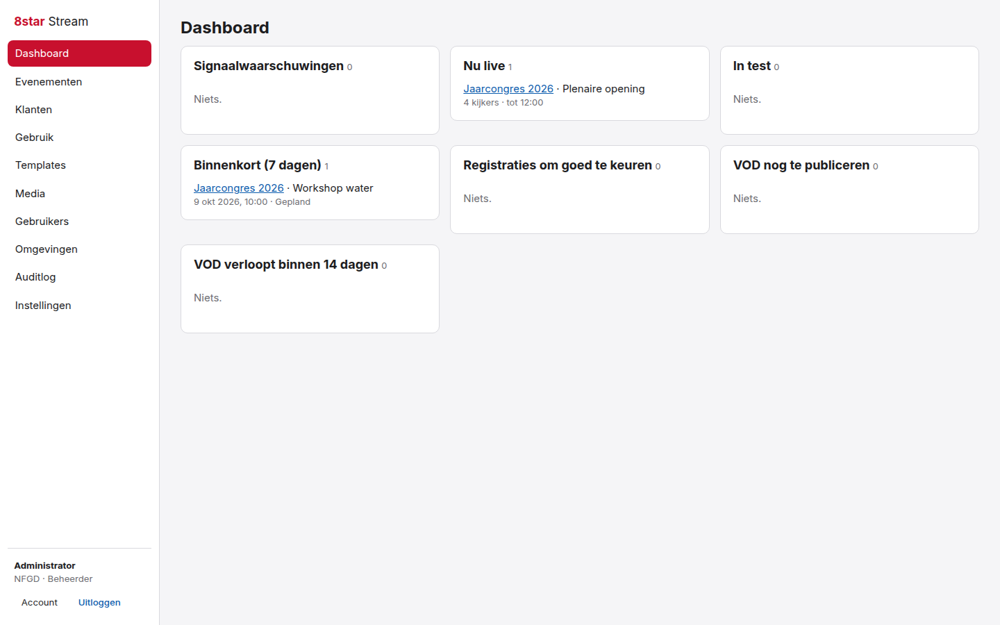
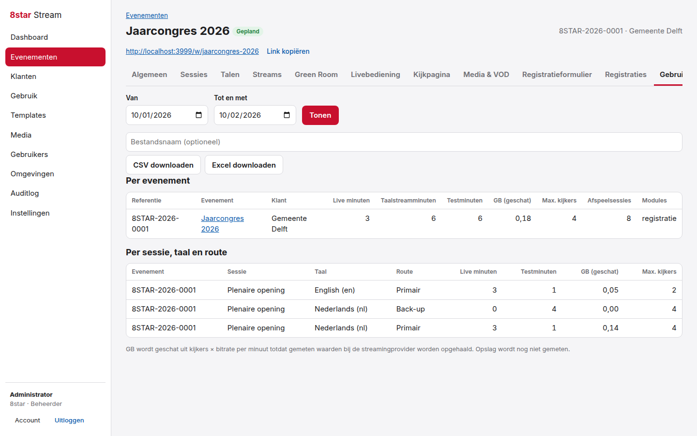

# 8star Stream

A self-hosted livestream platform for event productions. One permanent watch link per event shows the pre phase, the livestream, after live and finally the VOD. Viewers choose their language on the same page; technicians test real encoder streams in a private Green Room, switch between primary and backup routes, and see stream minutes, estimated data volume and viewer numbers.

Provider-agnostic: any encoder and streaming service that delivers HLS works (Wowza, MediaMTX, a CDN, …). The chat is a separate product, [8star Chat](https://github.com/TimoM84/8star-chat), embedded per event.

Built with Node.js. No external database: everything is stored in one Docker volume (SQLite).



## Features

- **Permanent watch link and embed code** per event: pre phase → live → after live → VOD, without changing the link
- **Events with days, sessions and rooms**; dates can change without changing the link; copy an event or a session for recurring productions
- **Phases by schedule or by hand**; *Test* status keeps the public page in the pre phase
- **Languages**: per language its own streams, media, page texts, form texts and VOD; the viewer switches without reloading (`?lang=en` for a direct link); new languages can be copied from an existing one
- **Primary and backup route** per session and language, each with its own encoder and provider; manual switch with confirmation and reason, logged, reaching viewers within seconds
- **Signal monitoring** of every route on air (HLS playlist must keep advancing), with a visible and audible alarm in live control and a signal list on the dashboard; the viewer's player shows "back in a moment" and restarts by itself when the signal returns
- **Player**: own controls with LIVE badge and "go to live", seek bar for recordings, volume, speed, full screen, **language choice inside the player** and **subtitles**; works with keyboard and touch
- **Green Room**: play any route of any session and language with picture and sound, never visible to viewers
- **Watch page editor**: visual editor and HTML source, images from the media library (alt text, size, alignment), buttons, variables such as `{{event}}` and `{{watchUrl}}`, draft and publish per phase and language, desktop and mobile preview, templates (central and per reseller), branding per customer and event
- **Safe HTML**: scripts, event handlers, unsafe links and iframes from unapproved sources are refused with a readable message
- **Registration**: form builder with 11 field types, required/optional, active/inactive, order, answer options, texts per language; collect sign-ups, give access directly, or approve by hand; consent recorded with the exact text and time; search, filter and CSV/Excel export; old registrations stay readable when the form changes
- **Access**: public, access code, or registration
- **After live and VOD**: media per phase and language, VOD by URL with start and end point (original kept), chapters, subtitle tracks (WebVTT or SRT, one per language, up to 12), publication and expiry date or unlimited with a reason
- **Usage**: live minutes, language stream minutes and test minutes per event, session, language and route; estimated GB (viewers × bitrate); concurrent and peak viewers, plays; CSV/Excel export with a clear, editable file name
- **Resellers**: separate environments; a reseller only sees its own customers, users, events, registrations, media, templates, reports and audit log
- **Roles**: administrator, technician, content manager
- **Audit log** of sign-ins, changes, publications, phase and route switches, signal loss and deletions, with old and new values
- Admin in Dutch and English; watch page in Dutch, English, German and French; works on desktop, tablet and phone

## Screenshots

| Live control (route switch, signal, viewers)                               | Watch page on a phone                                                  |
| -------------------------------------------------------------------------- | ---------------------------------------------------------------------- |
|  |  |
| **Green Room**                                                             | **Streams: primary and backup per language**                           |
|       |  |
| **Watch page editor**                                                      | **Registration form builder with preview**                             |
|      |    |
| **Dashboard**                                                              | **Usage**                                                              |
|                                |  |

_All names and events in the screenshots are fictional; the video is a generated test signal._

## Quick start

Create a `compose.yaml` file. Docker builds the image straight from this repository:

```yaml
services:
  8star-stream:
    build:
      context: https://github.com/TimoM84/8star-stream.git#main
    image: 8star-stream:latest
    pull_policy: build
    restart: unless-stopped
    ports:
      - "9877:3000"
    environment:
      ADMIN_EMAIL: admin@example.com
      ADMIN_PASSWORD: choose-a-long-password
      PLATFORM_NAME: NFGD
      TRUST_PROXY: "true"
    volumes:
      - 8star_stream_data:/data
    read_only: true
    tmpfs:
      - /tmp
    cap_drop:
      - ALL
    security_opt:
      - no-new-privileges:true
    stop_grace_period: 15s

volumes:
  8star_stream_data:
    name: 8star_stream_data
```

Start it with `docker compose up -d`, open `http://YOUR-SERVER-IP:9877` and sign in with `ADMIN_EMAIL` and `ADMIN_PASSWORD` (at least 12 characters; only used for the very first start).

`#main` always builds the newest version. To stay on a fixed release, use a tag instead, for example `#v0.1.0`.

### Dockhand and Portainer

1. Create a new stack.
2. Paste the Compose configuration above, or choose **From Git** with repository `https://github.com/TimoM84/8star-stream.git` and compose file `compose.yaml`.
3. Set `ADMIN_PASSWORD` for the first start (as a secret where possible) and deploy.

The named volume keeps all data when the container is rebuilt. Never remove the volume when you remove the stack.

## Settings

| Variable          | Default            | Meaning                                                                                                      |
| ----------------- | ------------------ | ------------------------------------------------------------------------------------------------------------ |
| `ADMIN_EMAIL`     | `admin@example.com`| First platform administrator (first start only)                                                              |
| `ADMIN_PASSWORD`  | —                  | Password of that administrator, at least 12 characters (first start only)                                    |
| `PLATFORM_NAME`   | `NFGD`             | Name of the platform environment; also the prefix of project references (`NFGD-2026-0001`)                   |
| `PUBLIC_URL`      | from the request   | Public address used in watch links and embed codes, e.g. `https://live.example.com`                          |
| `TRUST_PROXY`     | `false`            | `true` behind a reverse proxy (Nginx Proxy Manager): use `X-Forwarded-*` for address, host and HTTPS          |
| `COOKIE_SECURE`   | `auto`             | `auto` sets the Secure flag on HTTPS; `true`/`false` to force                                                |
| `FRAME_ANCESTORS` | `*`                | Sites that may embed the watch page, e.g. `https://www.customer.nl https://*.customer.nl`. The admin itself can never be embedded |
| `PROBE_SECONDS`   | `10`               | How often routes on air are checked for a signal                                                             |
| `MAX_UPLOAD_MB`   | `10`               | Maximum image upload size                                                                                     |
| `TZ`              | `Europe/Amsterdam` | Time zone for dates in page variables                                                                         |

Behind Nginx Proxy Manager: a proxy host to port `9877` with an SSL certificate and *Force SSL*, and `TRUST_PROXY=true`.

## How it works

### Streams

Every route has a **playback URL (HLS `.m3u8`)** that viewers play, and ingest details that the technician enters in the encoder. The provider only determines how these are filled in:

| Provider                 | You enter                                     | Playback URL                                       |
| ------------------------ | --------------------------------------------- | -------------------------------------------------- |
| Any provider             | ingest URL, stream key, playback URL          | as entered                                         |
| Wowza Streaming Engine   | ingest host, playback host, application, stream name | `{playback host}/{application}/{stream}/playlist.m3u8` |
| MediaMTX                 | ingest host, HLS host, path                   | `{HLS host}/{path}/index.m3u8`                     |

The platform checks the playlist of every route that is on air (from three hours before the start until one hour after the end, during *Test*, and while a session is set to live by hand). A route has a **signal** while new segments keep appearing; it is **lost** when the playlist cannot be loaded, has ended, or has not advanced for three segment durations (at least 20 seconds).

**MediaMTX tip:** for the smoothest playback through a reverse proxy use plain HLS instead of low-latency HLS: set `MTX_HLSVARIANT=fmp4`, `MTX_HLSSEGMENTDURATION=2s` and `MTX_HLSSEGMENTCOUNT=7` as environment variables of the MediaMTX container, and let the encoder use a 2 second keyframe interval. Delay is then about 6 to 8 seconds.

Viewers' browsers load the stream directly from the provider (not through this server). The stream's playback URL is only handed out while the session is publicly live and the viewer has access; during *Test* it is never handed out. A playback URL that someone already knows is not secret, though: protect it at the provider (token authentication) if that matters.

### Phases

| Event status | Watch page                                                                                     |
| ------------ | ---------------------------------------------------------------------------------------------- |
| Draft        | pre phase                                                                                      |
| Test         | pre phase; streams can be checked in the Green Room                                            |
| Scheduled    | by schedule: pre → live (start time) → after live (end time); a manual phase per session wins |
| Archived     | after live or VOD                                                                              |

After live becomes VOD per language as soon as that language's recording is published and available.

### Usage

Every minute in which a route had a signal is stored once: as a **live minute** when the session is publicly live and the route is the active route, otherwise as a **test minute**. *Live minutes* of an event count each minute once; *language stream minutes* add up all language streams that were live. Data volume is **estimated** as viewers × route bitrate per minute; measured values from a provider API can be added per provider later. Viewers are counted with a beacon from the watch page every 30 seconds while a video plays.

### Roles and rights

| Function                                         | Administrator | Technician | Content manager |
| ------------------------------------------------ | :-----------: | :--------: | :-------------: |
| Events: view                                     | ✓             | ✓          | ✓               |
| Events, sessions, languages: create and change   | ✓             |            |                 |
| Status *Test* / *Scheduled*                      | ✓             | ✓          |                 |
| Archive and delete                               | ✓             |            |                 |
| Streams, Green Room, live control, phase         | ✓             | ✓          |                 |
| Watch page, templates, media, pre/after media    | ✓             |            | ✓               |
| Registration form and registrations              | ✓             |            | ✓               |
| VOD                                              | ✓             |            | ✓               |
| Customers, users, usage, audit log               | ✓             |            |                 |
| Environments, central templates, iframe sources  | platform only |            |                 |

Content managers never see ingest details, stream keys or playback URLs.

## Not in this version yet

These parts of the requirements are planned for following versions:

- Email: confirmation and access mails for registrations, signal-loss mails, VOD expiry reminders to the contact (needs SMTP settings)
- Rates and calculated amounts per reseller and customer
- Measured GB and storage from provider APIs (Wowza, CDN)
- Trimming that produces a new video file (now: start and end point applied by the player), uploading video files
- Waiting list, maximum number of registrations, conditional fields, registration per session
- Retention periods with automatic clean-up, recording consent log
- Live subtitles (needs a caption source; the player already shows subtitle tracks that an HLS stream contains), own domains per reseller, polls

## Development

```bash
npm install          # also copies hls.js to public/vendor
ADMIN_PASSWORD=choose-a-long-password npm start
npm test             # rights, isolation, phases, watch link, registration, usage, headers
npm run check:i18n   # translations complete
```

Node.js 22.13 or newer (uses the built-in `node:sqlite`).

## License

Copyright © 2026 Timo Manders. All rights reserved. Use, copying, modification or distribution is only permitted with prior written permission. See [LICENSE](LICENSE).
